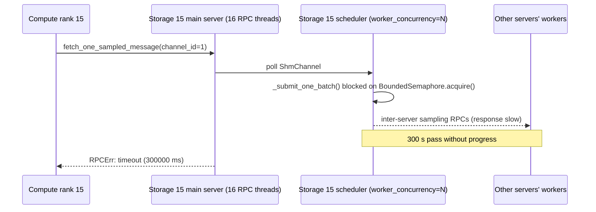

______________________________________________________________________

## name: vai-debug description: Use when a Vertex AI custom job has failed (RPC timeout, OOM, NCCL error, silent stall, etc.) and the user gives you the numeric job id and asks you to figure out why. Downloads metadata + logs, reads the entrypoint code, reconstructs a fact-based timeline with verbatim log citations, and writes a grounded debug doc with a dataflow diagram and an actionable next-step plan.

# Vertex AI Distributed Job Debug

Investigate a failed Vertex AI custom job by downloading its metadata + logs, reading the entrypoint code,
reconstructing a fact-based timeline, and writing up a summary doc with citations, a dataflow diagram, and an actionable
next-step plan.

## When to use

Invoke this skill when the user gives you a Vertex AI **custom job ID** (a long numeric string like
`5602738366085857280`) and asks you to figure out why it crashed or is behaving badly. It works best for:

- distributed training/inference jobs across `workerpool0/1/2/...`
- crashes that surface as RPC timeouts, OOMs, NCCL errors, or silent stalls
- jobs where the failing replica is one of many and you need to triage

It is NOT a substitute for plain log skimming when the user has already pinpointed the bug — go directly to
`gcloud logging read` in that case.

## Inputs

`$ARGUMENTS` should contain:

1. `<job-id>` — **required**. The numeric Vertex AI custom job ID.
2. `project=<gcp-project>` — **required**. The GCP project the job ran in. If the user did not provide it, ask them
   before running anything. Do not guess, do not default to a project from a previous conversation, and do not hardcode
   any specific project in this skill.
3. `main_fn=<path>` — optional. The entrypoint file (e.g. `examples/link_prediction/heterogeneous_training.py`). If
   omitted, infer it from the job's `containerSpec.args` / `containerSpec.command` fields after step 2 below.

If the user passes a Cloud Console URL instead of a job ID, extract the ID from either form the console / GiGL may emit:

- query-param form: `?job_id=<id>` (older console URLs)
- path-segment form: `/training/<id>?project=...` — this is what GiGL itself logs (see
  `gigl/common/services/vertex_ai.py:362`), so it is the most likely paste

The project (`?project=...`) and region (`/locations/<region>/`) are also typically embedded in the URL — but still
confirm both with the user rather than parsing them silently.

## Region

If the user mentioned a region in this conversation, use that. Otherwise ask. `us-central1` is the most common region
but do not assume it without confirmation.

## Workspace

All artifacts go under `.tmp/job_<job-id>_<slug>/` in the GiGL repo root, where `<slug>` is the job's `displayName`
lowercased with non-alphanumerics replaced by `_` (e.g.
`.tmp/job_5602738366085857280_link_prediction_training_run_42/`). **Always include both the numeric job id and the
human-readable name** so the directory is greppable, listable, and recognizable by either.

`.tmp/` is gitignored at the repo root — both the directory and its contents are local-only and never committed.
`mkdir -p .tmp/job_<job-id>_<slug>/` before writing anything. Inside it expect to land:

- `metadata.json` — full `gcloud ai custom-jobs describe` output
- `logs.json`, `logs_mid.json`, `logs_tail.json` — sharded raw logs
- `analyze.out` — captured stdout from your reusable analysis script (the script itself lives at `tools/ai/<name>.py`,
  see step 5)

The final write-up goes to `docs/YYYYMMDD-vai_debug_job_<job-id>_<slug>.md` (date-prefixed, snake_case, both job id +
slug per the user's naming preference). If a date-prefixed file already exists for this job, append `-2`, `-3`, etc.

## Analysis tooling

**Prefer creating well-named, reusable scripts in `tools/ai/<descriptive-name>.py` over per-job throwaways.** Examples
of good names: `tools/ai/filter_vai_logs_by_replica.py`, `tools/ai/summarize_vai_log_errors.py`,
`tools/ai/extract_first_last_log_per_rank.py`.

`tools/` is gitignored, so `tools/ai/` is **local-only** — these scripts persist on this machine across debug sessions
but are not shared via git. The goal is to build up a small local library of VAI debugging tools so the next failed job
(and the next Claude instance to debug one on this machine) can reuse them instead of rewriting from scratch.

To make this work, every script in `tools/ai/` MUST be:

- **Well-documented at the top.** A module docstring with: what it does, what inputs it takes (CLI args), what output
  format it produces, and at least one example invocation. A future session should be able to read the docstring alone
  and decide whether the script fits the current job — without re-reading the source.
- **Parameterized via `argparse`** (or similar). Take `--job-dir` / `--logs-dir` / `--filter` etc. as CLI args. Do
  **not** hardcode `.tmp/job_<id>_<slug>/` or any single job's specifics — the same script must work across jobs.
- **Composable.** Prefer multiple small focused scripts (one for filtering by replica, one for deduping errors, one for
  extracting timestamps per rank) over one monolithic `analyze.py`. Each script does one thing well and prints to stdout
  so the next can pipe it.

If you find logic that is genuinely one-off and won't help future jobs, scope it to a small inline section and put a
`# job-specific:` comment over it — but the rest of the script should remain reusable.

Before writing a new script, run `mkdir -p tools/ai` (the directory may not exist yet on a fresh checkout) and then
**list `tools/ai/`** and read the docstrings of existing scripts. An empty directory means no reusable tools yet — that
is fine, just create the first one. If an existing script already covers what you need, reuse it. Only create a new
script when no existing one fits.

______________________________________________________________________

## Instructions

Execute the steps below in order. **Do not skip ahead.** Each step's output feeds the next. If a step fails (e.g. the
job ID doesn't exist, logs are empty), tell the user clearly and stop — don't fabricate.

### 1. Download metadata

```bash
mkdir -p .tmp/job_<job-id>_<slug>
gcloud ai custom-jobs describe <job-id> \
  --project=<project> --region=<region> \
  --format=json > .tmp/job_<job-id>_<slug>/metadata.json
```

Note: at this exact step you don't yet have the `<slug>` (it comes from `displayName` inside the metadata). The first
time, mkdir into `.tmp/job_<job-id>/`, then `mv` to `.tmp/job_<job-id>_<slug>/` after parsing `displayName`. Or write
metadata to a temp file, parse the slug, then create the final dir.

Then extract and report:

- `displayName`, `state`, `createTime`, `startTime`, `endTime`
- `error.message` (the top-line crash reason, if any)
- For each `workerPoolSpec`: `machineSpec.machineType`, `machineSpec.acceleratorType`/`acceleratorCount`,
  `replicaCount`, `containerSpec.command`, `containerSpec.args`. **Some pools may be empty `{}` placeholders** — GiGL
  inserts an empty workerpool1 when graph-store compute has only one replica (see
  `gigl/common/services/vertex_ai.py:324`; the integration test in
  `tests/integration/common/services/vertex_ai_test.py:96` asserts this). Treat empty pools as "unused placeholder —
  skip" and do not try to dereference `machineSpec` or `containerSpec` on them.

`gcloud ai custom-jobs describe` prefixes its output with `Using endpoint [...]` — the file may have a non-JSON first
line. Strip it before `json.load` if needed (or just use a small script after `tail -n +2`).

State handling:

- `JOB_STATE_FAILED` / `JOB_STATE_CANCELLED`: proceed normally.
- `JOB_STATE_RUNNING`: a stuck/stalled live job is in scope ("silent stalls" per the When-to-use section). Proceed, but
  note `endTime` will be missing — use the latest log timestamp as the provisional timeline end and label the state as
  running everywhere downstream.
- `JOB_STATE_SUCCEEDED`: nothing to debug. Confirm with the user before proceeding.
- Any other state (`PENDING`, `QUEUED`, etc.): confirm with the user.

**Optional: download task and resource configs.** GiGL injects `--job_name`, `--task_config_uri`, and
`--resource_config_uri` into `containerSpec.args` (see `gigl/src/common/vertex_ai_launcher.py:254`). Trainer args like
`batch_size`, `num_neighbors`, `worker_concurrency`, etc. live in the task config — not in the job metadata (verify in
`examples/link_prediction/heterogeneous_training.py:760`). If your eventual action plan will reference any config knob,
`gsutil cp` the `--task_config_uri` and `--resource_config_uri` values into `.tmp/job_<job-id>_<slug>/` and parse them.
Skip this if the failure is clearly a runtime error (NCCL, OOM, segfault) where config knobs are not load-bearing.

### 2. Identify the entrypoint (if not provided)

If the user gave `main_fn=<path>`, use it.

Otherwise, parse `containerSpec.command` (usually `["python", "-m", "<module.path>"]`) and `containerSpec.args` from
each workerpool to figure out the entrypoint module. Convert the module path to a file path (replace `.` with `/`,
append `.py`).

Workerpools may have different entrypoints — record them all (compute pool vs storage pool typically differ in
distributed graph-store jobs).

### 3. Download logs (sharded)

**Always include explicit timestamp bounds derived from the metadata.** `gcloud logging read` defaults `--freshness=1d`
when no timestamp filter is set in the query, so a job that ran more than a day ago will silently return zero entries
even though Cloud Logging has retained them (default retention is 30 days). This is the most common silent footgun.

`gcloud logging read` returns at most `--limit` entries per call (100,000 is the hard upper bound). For long-running
jobs, paginate forward by timestamp:

```bash
# First chunk — bound to the job's actual run window with a small buffer on endTime
gcloud logging read 'resource.type="ml_job" AND resource.labels.job_id="<job-id>" AND timestamp>="<startTime>" AND timestamp<="<endTime + 5m>"' \
  --project=<project> --format=json --order=asc --limit=100000 \
  > .tmp/job_<job-id>_<slug>/logs.json
```

If the job is still running (`endTime` absent), drop the upper bound — or substitute "now" — and add a generous
`--freshness` so live logs aren't cut off.

Inspect the count and last timestamp of the shard via a small `tools/ai/` script (do NOT use `python3 -c` — see
"Analysis tooling" above).

If the count came back at the limit (100000), there are more logs. Fetch the next chunk with a **strict** lower bound
(`timestamp>`, not `>=`) so the boundary entry is not re-fetched:

```bash
gcloud logging read 'resource.type="ml_job" AND resource.labels.job_id="<job-id>" AND timestamp>"<last-timestamp>" AND timestamp<="<endTime + 5m>"' \
  --project=<project> --format=json --order=asc --limit=100000 \
  > .tmp/job_<job-id>_<slug>/logs_mid.json
```

(If the Cloud Logging filter parser rejects strict `>`, fall back to `timestamp>="<last-timestamp>"` and rely on the
cross-shard `insertId` dedupe in step 5 to drop the duplicate boundary entry — but never skip the dedupe.)

Repeat with `logs_tail.json` etc. **Stop when EITHER** (a) the shard returned `count < limit`, **OR** (b) the shard
contains zero `insertId`s not already seen in earlier shards. Do NOT loop on "last timestamp past endTime" — silent
stalls and crashed jobs may have no logs anywhere near `endTime`.

Also try the alternate filter `labels."ml.googleapis.com/custom_job_id"="<job-id>"` if the first query returns 0 entries
(older jobs use this label).

### 4. Read the entrypoint code (intention)

Read each entrypoint file to understand **what the job is supposed to do**. Pay attention to:

- The high-level lifecycle: setup → train → val → test → save → cleanup
- The data loaders / RPC clients being constructed
- The barriers and `dist.all_gather`/`broadcast` calls
- The shutdown path
- Any retries, timeouts, or fail-fast assertions

**Do not skim.** Read the function the user pointed at (or the inferred entrypoint) plus the helpers it calls. Note
which file:line ranges define each phase — you'll cite them in the write-up.

### 5. Read the logs (what actually happened)

Use the reusable scripts in `tools/ai/` (or create new ones following the "Analysis tooling" rules above). Do not write
a per-job `analyze.py` inside `.tmp/`.

A typical analysis pipeline needs scripts that can:

1. Load all log shards and dedupe on `insertId`

2. Sort by `timestamp`

3. Extract the message via a small helper that handles both `textPayload` and `jsonPayload.message`:

   ```python
   def extract_text(entry):
       text = entry.get("textPayload", "")
       if text:
           return text
       jp = entry.get("jsonPayload", {})
       if isinstance(jp, dict):
           return jp.get("message", str(jp))
       return str(jp)
   ```

4. Summarize, at minimum:

   - Job lifecycle events: filter on `entry["resource"]["labels"]["task_name"] == "service"`. Note this is a **resource
     label**, not a top-level field on the entry — a literal `entry.get("task_name")` will miss every lifecycle event.
   - First and last log timestamps per replica (to find which went silent first). Replica identity also lives in
     `resource.labels` (e.g. `task_name == "workerpool1-14"`).
   - Init-phase and steady-state progress: **derive the signature strings from the entrypoint code you read in step 4**
     rather than hardcoding a phrase list. Different entrypoints log different markers — e.g.
     `examples/link_prediction/heterogeneous_training.py:149` logs `finished setting up main loader` and
     `examples/link_prediction/heterogeneous_training.py:169` logs `finished setting up random negative loader`. Pick
     out the per-rank "loader ready", "model initialized", "first batch", and val-cycle markers actually emitted by the
     entrypoint(s) for this job.
   - Errors: **case-insensitive** match on
     `error|traceback|rpcerr|runtimeerror|broken future|terminated|sigterm|sigkill|oom|out of memory|killed|low on memory|econnreset|eof:|nccl|cuda error|resourceexhausted|deadline exceeded|connection reset by peer|segfault|segmentation fault|no space left|disk quota`
   - For storage/sampler jobs: `shared_sampling_scheduler` lines — how long after the first stall did they keep emitting
     `steady_state` logs?

5. **Dedupe noisy errors before printing.** Show the first occurrence of each unique error prefix, the count, and the
   time range. Do not dump 10,000 identical traceback lines.

Each of these can be its own small script in `tools/ai/`, parameterized by `--job-dir .tmp/job_<job-id>_<slug>/`. Run
them with `python tools/ai/<script>.py --job-dir .tmp/job_<job-id>_<slug>/ ...`. Capture stdout to
`.tmp/job_<job-id>_<slug>/analyze.out` if it's too long to keep open in context.

If you genuinely need glue logic specific to this one job (e.g. correlating a unique log signature with a specific
replica numbering scheme), keep it short and inline — but put any reusable piece into `tools/ai/`.

### 6. Reconstruct the timeline

Cross-reference the metadata + entrypoint code + log analysis to produce a **single timeline** that a future reader can
follow without re-reading the raw logs. The timeline should:

- Start at `startTime` and end at `endTime` (or, for a still-running job, at the latest log timestamp; mark this as
  provisional)
- Cite **exact** UTC timestamps and replica names (`workerpool1-14`, `workerpool2-36`, etc.)
- Quote the **exact** log line — copy the text verbatim, do not paraphrase. Wrap quoted lines in backticks.
- For each phase boundary, link back to the entrypoint code with `file:line` references (e.g. "barrier at
  `distributed_training_graph_store.py:653`")
- Identify the **first abnormal event**, not just the loudest one. RPC timeouts after 300 s are a *consequence*; the
  upstream cause is whatever went silent 300 s earlier. Hunt for last-good logs per replica.

If the symptom is a 300 s RPC timeout, the upstream stall is almost always 300 s before the timeout — search the logs at
`crash_time - 300s` for the last-good activity.

### 7. Write the summary doc

Create `docs/YYYYMMDD-vai_debug_job_<job-id>_<slug>.md`. Use the date the job ran (or today, if you can't tell). The doc
must contain these sections in this order:

#### Header

```markdown
# Vertex AI Job <job-id> (<displayName>) Debug — <one-line symptom>

**Date:** YYYY-MM-DD
**Job:** `<job-id>` (`<displayName>`)
**Project / Region:** `<project>` / `<region>`
**State:** `<state-from-metadata>` (e.g. `JOB_STATE_FAILED`, `JOB_STATE_CANCELLED`, `JOB_STATE_RUNNING`) — never hardcode
**Started:** YYYY-MM-DDTHH:MM:SSZ
**Ended:** YYYY-MM-DDTHH:MM:SSZ (≈ <duration>) — for a still-running job write `Ended: in-progress (timeline ends at <last-log-timestamp> UTC, provisional)`
**Top-line error:** `<error.message verbatim>` if present in metadata; otherwise fall back in this order: (1) first `severity=ERROR` entry from the service task, (2) first non-service stack-trace line, (3) `(none recorded)`. Always state which source you used in parentheses, e.g. `<message>` (source: first ERROR service log).
```

#### Cluster topology

A table of workerpools with role (compute/storage/server/...), machine type, GPU, replica count, and entrypoint.

#### Intention (what the job was supposed to do)

A short prose summary of the lifecycle as understood from the entrypoint code, with file:line references for each phase.
Don't quote the code wholesale — explain it.

#### Timeline

Use either a Markdown table (`| Time (UTC) | Replica | Event |`) or a flat bullet list, depending on density. Each entry
must include the UTC timestamp, the replica, and the verbatim log line in backticks. Group by phase if helpful (init /
training / failure / cleanup).

#### Dataflow diagram

Include at least one Mermaid `sequenceDiagram` or `flowchart` showing the data path that broke. For sampling/RPC stalls,
draw the chain from compute-side `next()` through `RemoteReceivingChannel` → server `fetch_one_sampled_message` →
`SharedDistSamplingBackend` scheduler → sampler workers → inter-server RPCs, and mark the link that froze. Example:

````markdown

````

If the bug is a memory issue, draw a memory-allocation flow instead.

#### Root cause

A 1–3 paragraph explanation that ties the timeline + dataflow + code together. Every claim must cite either a
`file:line` or a verbatim log line. If you are not sure of the root cause, say so explicitly and pivot to step 8.

#### What worked / what didn't (if applicable)

When the user has tried previous fixes, list them as bullets with the outcome. This is especially valuable for iterative
debugging where each job's failure informs the next.

#### Action plan

A numbered list. Each item must:

1. State the change (config knob, code edit, machine size, etc.)
2. Cite the file:line where the change goes (or `--flag` to add)
3. Predict the expected effect ("expect first val cycle to complete" / "expect compute RAM peak to drop from ~50 GB to
   ~30 GB")
4. Note any risk or follow-up validation needed

If you are uncertain about the root cause, the action plan should focus on **instrumentation to add** (logs, counters,
dumps) rather than blind fixes. Be explicit: "Add `logger.info(f'... {state} ...')` at `file:line` so the next run
prints X."

#### References

- Local logs path (`.tmp/job_<job-id>_<slug>/`)
- Analysis script path(s) under `tools/ai/`
- Related prior docs (e.g. `docs/<other-debug>.md`) — search `docs/` for any existing analyses of related jobs
- Code references (the entrypoint, key library files)

### 8. Coherence check

Before reporting back to the user, **read your own write-up end-to-end** and check:

- Every quoted log line is a real, verbatim copy — no paraphrasing or made-up timestamps
- Every `file:line` reference points to code that actually exists (spot-check with the Read tool if uncertain)
- Claims do not contradict each other. If section A says "all 60 servers stalled at T+10s" and section B says "rank 15's
  server stalled first at T+30s", reconcile them.
- The dataflow diagram matches the timeline matches the root cause section
- The action plan is grounded — every recommendation traces back to evidence in the timeline or code

If you find inconsistencies, fix them before responding. Do not ship a write-up where the narrative disagrees with
itself.

### 9. Report

Tell the user:

1. The path to the write-up: `docs/YYYYMMDD-vai_debug_job_<job-id>_<slug>.md`
2. A 2–3 sentence summary of root cause + recommended next step
3. The path to local logs (`.tmp/job_<job-id>_<slug>/`) and which `tools/ai/` script(s) you used or added (so they can
   re-run analyses)
4. Any open questions / things you couldn't resolve from the logs

If the action plan involves code changes, do NOT make them in this skill — the user invoked this for diagnosis, not
implementation. Offer to make the changes in a follow-up message.

______________________________________________________________________

## Anti-patterns to avoid

- **Don't run `python3 -c` for analysis.** Write a reusable, well-documented script at `tools/ai/<name>.py` instead (see
  "Analysis tooling").
- **Don't write per-job throwaway scripts.** Tools belong in `tools/ai/`, parameterized via `argparse` so other jobs
  (and other engineers / instances) can reuse them.
- **Don't skip the docstring on `tools/ai/` scripts.** Without a clear top-of-file docstring (purpose, args, output,
  example), the script is not actually reusable — nobody knows what it does.
- **Don't paraphrase log lines.** Copy them verbatim, including the rank and timestamp prefixes the logger emits.
- **Don't skip code reading.** A timeline without code grounding is just a transcript of error messages.
- **Don't propose fixes without evidence.** "Try increasing X" is not an action plan unless you can cite the line of
  code where X gates a behavior that the timeline shows is the bottleneck.
- **Don't fabricate a root cause when you're uncertain.** Step 8's "instrumentation to add" path exists for exactly that
  case.
- **Don't truncate the timeline at the loudest event.** A 300 s RPC timeout is rarely the first thing that went wrong —
  find what happened at `crash_time - 300s`.
- **Don't write a 1000-line monolithic script.** Keep each script in `tools/ai/` focused and under ~200 lines. Prefer
  multiple small composable scripts over one giant analyzer.
- **Don't dump entire log files into the write-up.** Quote only the lines that ground a specific claim.
- **Don't guess the GCP project.** It's a required input — ask the user if they didn't supply it.
- **Don't drop the human-readable name from paths.** Always use both `<job-id>` and `<slug>` in `.tmp/` directories and
  `docs/` filenames so the artifacts are recognizable later.
