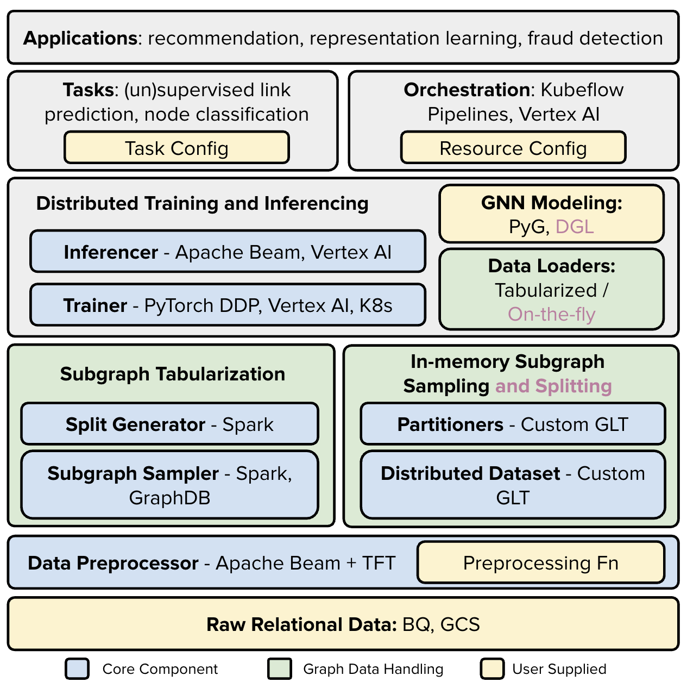

# GiGL: Gigantic Graph Learning

GiGL is an open-source library for training and inference of Graph Neural Networks at very large (billion) scale.

```{only}
::not html

For best experience in reading GiGL documentation visit our documentaiton website: https://snapchat.github.io/GiGL/
```

## Key Features 🌟

- 🧠 **Versatile GNN Applications**: Supports easy customization in using GNNs in supervised and unsupervised ML
  applications like node classification and link prediction.

- 🚀 **Designed for Scalability**: The architecture is built with horizontal scaling in mind, ensuring cost-effective
  performance throughout the process of data preprocessing and transformation, model training, and inference.

- 🎛️ **Easy Orchestration**: Simplified end-to-end orchestration, making it easy for developers to implement, scale, and
  manage their GNN projects.

______________________________________________________________________

## Installation ⚙️

See [Installation Instructions](docs/user_guide/getting_started/installation.md)

## Getting Started 🚀

If you like to get started right away, see our [Quick Start Guide](docs/user_guide/getting_started/quick_start.md)

The best way to get more familiar with GiGL is to go through our detailed [User Guide](docs/user_guide/index.rst) and
see our [API documentation](docs/api/index.rst)

### Architecture

GiGL includes a range of components, each built to support the platform’s end-to-end GraphML workflows. For an overview
of the architecture and detailed information, please refer to
[GiGL Components](docs/user_guide/overview/architecture.md). Below, we provide a brief summary for quick reference.

The figure below illustrates at a high level how components of GiGL work together.
(<span style="color:purple">Purple</span> items are work-in-progress.)



The figure below is a example GiGL workflow with tabularized subgraph sampling for the task of link prediction, in which
the model is trained with triplet-style contrastive loss on a set of anchor nodes along with their positives and
(in-batch) negatives.


### Usage

GiGL offers 3 primary methods of usage to run the components for your graph machine learning tasks.

#### 1. Importable GiGL

To easily get started or incorporate GiGL into your existing workflows, you can simply `import gigl` and call the
`.run()` method on its components.

<details>
<summary>Example</summary>

```python
from gigl.src.training.trainer import Trainer

trainer = Trainer()
trainer.run(task_config_uri, resource_config_uri, job_name)
```

</details>

#### 2. Command-Line Execution

Each GiGL component can be executed as a standalone module from the command line. This method is useful for batch
processing or when integrating into shell scripts.

<details>
<summary>Example</summary>

```
python -m \
    gigl.src.training.trainer \
    --job_name your_job_name \
    --task_config_uri gs://your_project_bucket/task_config.yaml \
    --resource_config_uri "gs://your_project_bucket/resource_config.yaml"
```

</details>

#### 3. Orchestration

GiGL also supports pipeline orchestration using different orchestrators. Currently supported include local, and Vertex
AI (backed by Kubeflow Pipelines). This allows you to easily kick off an end-to-end run with little to no code.

See [Orchestration Guide](docs/user_guide/getting_started/orchestration.md) for more information

#### Configuration 📄

Before getting started with running components in GiGL, it’s important to set up your config files. These are necessary
files required for each component to operate. The two required files are:

- **Resource Config**: Details the resource allocation and environmental settings across all GiGL components. This
  encompasses shared resources for all components, as well as component-specific settings.

- **Task Config**: Specifies task-related configurations, guiding the behavior of components according to the needs of
  your machine learning task.

To configure these files and customize your GiGL setup, follow our step-by-step guides:

- [Resource Config Guide](docs/user_guide/config_guides/resource_config_guide.md)
- [Task Config Guide](docs/user_guide/config_guides/task_config_guide.md)

## Tests 🔧

Testing in GiGL is designed to ensure reliability and robustness across different components of the library. We maintain
a wide collection of linting/formatting, unit, integration, cloud end-to-end integration tests, and large scale
performance testing.

One your PR is "Added to the merge queue", the changes will only merge once our CI
[runs these tests](https://github.com/Snapchat/GiGL/blob/main/.github/workflows/on-pr-merge.yml) and all of their status
checks succeed. The only caveat to this is the large scale performance testing that runs @ some regular cadence but is
not visible to open source users currently.

### Types of Tests

1. Linting/Formatting Tests
2. Unit Tests
3. Integration Tests - Simulate the pipeline behavior of GiGL components. These tests are crucial for verifying that
   components function correctly in sequence and that outputs from one component are correctly handled by the next.
4. Cloud Integration Test (end-to-end) - run a full end-to-end GiGL pipeline within GCP, also leveraging cloud services
   such as Dataflow, Dataproc, and Vertex AI
5. Perfornmance Tests (end-to-end) - not currently exposed publically; but benchmarked against internal datasets on a
   regular cadence.

### Running tests

#### Running tests against an open PR

If you have an open PR; you can also manually kick off these CI tests by leaving one of the following comments:

```{note}
**For safety reasons you will have to be a repo maintainer to be able to run these commands. Alternatively, see
instructions on how to run the tests locally, or ask a maintainer to run them for you.**
```

Run all unit tests:

```
/unit_test
```

Run all integration tests:

```
/integration_test
```

Run all end-to-end tests:

```
/e2e_test
```

#### Running tests locally

The entry point for running all tests is from the `Makefile`. We provide some documentation below on how you can run
these tests both locally and on an open PR (leveraring our build/testing system).

````{note}
  GiGL's unit, integration, and e2e tests require the use of a resource config. By default we use the `deployment/configs/unittest_resource_config.yaml` config for our CI/CD systems; but since most users wont have much access needed to compute/storage assets on the resources listed in our config, you won't be able to run the tests without doing some configuration.

  This is already taken care for you assuming you have already followed [quick start instructions to setup resource config](./docs/user_guide/getting_started/quick_start.md#3-config-setup). You will have a few environment variables exposed in your main shell file (i.e. `~/.zshrc`) that are needed for these tests to function.

  You can verify using command below:
  ```bash
  echo $GIGL_TEST_DEFAULT_RESOURCE_CONFIG
  echo $GIGL_PROJECT
  echo $GIGL_DOCKER_ARTIFACT_REGISTRY
  ```

  These environment variables override what is defined in the `Makefile` , allowing you to run tests as discussed below.
````

##### Lint/Formatting & Unit Tests

You can run all the linting & Formatting tests by calling

```bash
make check_format
```

You can run unit tests locally by calling

```bash
make unit_test
```

<details>
<summary>More Commands and Details</summary>

```bash
# Runs both Scala and Python unit tests, and the python static type checker
make unit_test

# Runs just Python unit tests
make unit_test_py
# You can also test specific files w/ PY_TEST_FILES=<TEST_FILE_NAME_GLOB>. e.g.:
make unit_test_py PY_TEST_FILES="eval_metrics_test.py"

# Runs just Scala unit tests
make unit_test_scala

# Run the python static type checker `mypy`
make type_check

# Run all formatting/linting tests
make check_format

# Runing Formatting/Linting tests individually
make check_format_py
make check_format_scala
make check_format_md

# Try fixing all formatting/linting issues
make format

# Try fixing Individual formatting/linting issues
make format_py
make format_scala
make format_md
```

All unit tests are organized in `python/tests/unit` folder, with the python entry point being
`python/tests/unit/main.py`

</details>

##### Integration Tests

Assuming you have followed instructions [above](#running-tests-locally), you should be able to run the integration tests
using:

```bash
make integration_test
```

Note: These tests may take a while to run!

<details>
<summary>More Commands and Details</summary>

If you want to run individual integration tests you can do so as follows:

```bash
make integration_test PY_TEST_FILES="file_loader_test.py"
```

All integration tests are organized in `python/tests/integration` folder with the python entry point being
`python/tests/integration/main.py`

</details>

##### Cloud Integration Test (end-to-end)

We have a few e2e test entrypoints defined in the Makefile i.e. `run_cora_nalp_e2e_kfp_test`,
`run_cora_snc_e2e_kfp_test`, etc. Search for `e2e` keyword.

```{caution}
As these are very long running tests, we advise you run them on the PR; leveraging commands [pointed out above](#running-tests-against-an-open-pr).
i.e. leaving `/e2e_test` comment in your open PR.

If you must run them locally, you will have to manually modify the resource configs for the relevant e2e test you want to run so that it is using resources that you have access to.

We plan on providing better support here in the future.
```

<br>

## Contribution 🔥

Your contributions are always welcome and appreciated.

> If you are new to open-source, make sure to check read more about it
> [here](https://www.digitalocean.com/community/tutorial_series/an-introduction-to-open-source) and learn more about
> creating a pull request
> [here](https://www.digitalocean.com/community/tutorials/how-to-create-a-pull-request-on-github).

Please see our [Contributing Guide](https://github.com/Snapchat/GiGL/blob/main/CONTRIBUTING.md) for more info.

## Additional Resources ❗

You may still have unanswered questions or may be facing issues. If so please see our
[FAQ](docs/user_guide/trouble_shooting/faq.md) or our [User Guide](docs/user_guide/index.rst) for further guidance.

## Citation

If you use GiGL in publications, we would appreciate citations to [our paper](https://arxiv.org/pdf/2502.15054):

```bibtex
@inproceedings{zhao2025gigl,
  title={GiGL: Large-Scale Graph Neural Networks at Snapchat},
  author={Zhao, Tong and Liu, Yozen and Kolodner, Matthew and Montemayor, Kyle and Ghazizadeh, Elham and Batra, Ankit and Fan, Zihao and Gao, Xiaobin and Guo, Xuan and Ren, Jiwen and Park, Serim and Yu, Peicheng and Yu, Jun and Vij, Shubham and Shah, Neil},
  booktitle={Proceedings of the 31st ACM SIGKDD Conference on Knowledge Discovery and Data Mining},
  year={2025}
}
```

## License 🔒

[MIT License](https://github.com/snapchat/gigl?tab=License-1-ov-file#readme)
