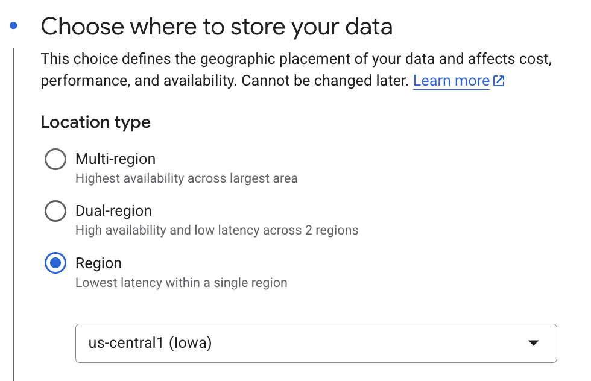

# Cloud Setup Guide

```{note}
The guidance below assumes you are not operating within a corporate network or under organization-specific policies. It provides instructions for onboarding directly onto raw GCP.

If your company or lab uses custom IAM roles, security policies, infrastructure management tools, or other internal systems, please refer to your internal documentation for how those may apply alongside the steps outlined here.

For more detailed information on meeting the prerequisites, refer to the official [GCP documentation](https://cloud.google.com/docs).
```

## GCP Project Setup Guide

1. A GCP account with billing enabled.

2. Created a GCP project.

3. Get `roles/editor` access to the GCP project

4. [Install and setup the gcloud CLI on your local machine](https://cloud.google.com/sdk/docs/install)

5. Enabled the necessary APIs on your GCP project:

   - [Compute Engine](https://console.cloud.google.com/apis/library/compute.googleapis.com)
   - [Dataflow](https://console.cloud.google.com/apis/library/dataflow.googleapis.com)
   - [VertexAI](https://console.cloud.google.com/apis/library/aiplatform.googleapis.com)
   - [Dataproc](https://console.cloud.google.com/apis/library/dataproc.googleapis.com)
   - [BigQuery](https://console.cloud.google.com/apis/library/bigquery.googleapis.com)

6. [Created GCS bucket(s)](https://console.cloud.google.com/storage/create-bucket) for storing assets. You need to
   create two different buckets for storing temporary and permanent assets. We will reference these as
   `temp_assets_bucket`, and `perm_assets_bucket` respectively throughout the library.

   - Pro-tip: Create regional buckets and use the same region for all your resources and compute to keep your cloud
     costs minimal i.e. `us-central1`
     
   - Ensure to use the "standard" default class for storage
   - (Optional) Enable Hierarchical namespace on this bucket
   - For your temp bucket its okay to disable `Soft delete policy (For data recovery)`, otherwise you will get billed
     unecessarily for large armounts of intermediary assets GiGL creates.
   - Since GiGL creates alot of intermediary assets you will want to create a
     [lifecycle rule](https://cloud.google.com/storage/docs/lifecycle) on the temporariy bucket to automatically delete
     assets. Intermediary assets can add up very quickly - you have been warned. Example:
     

7. [Create BQ Datasets](https://console.cloud.google.com/bigquery) for storing assets. You need to create two different
   BQ datasets in the project, one for storing temporary assets, and one for output embeddings. We will reference these
   as `temp_assets_bq_dataset_name`, and `embedding_bq_dataset_name` respectively throughout the library.

```{caution}
The BQ datasets must be in the same project as you plan on running the pipelines.
```



8. Create a [new GCP service account](https://console.cloud.google.com/iam-admin/serviceaccounts) (or use an existing),
   and [give it relevant IAM perms](https://cloud.google.com/iam/docs/roles-overview):

   - `bigquery.user`
   - `cloudprofiler.user`
   - `compute.admin`
   - `dataflow.admin`
   - `dataflow.worker`
   - `dataproc.editor`
   - `logging.logWriter`
   - `monitoring.metricWriter`
   - `notebooks.legacyViewer`
   - `aiplatform.user`
   - `dataproc.worker`

````{note}
Example of granting `bigquery.user`:
  ```bash
    gcloud projects add-iam-policy-binding $PROJECT_ID \
    --member="serviceAccount:$SERVICE_ACCOUNT" \
    --role="roles/bigquery.user"
  ```

  You youself are going to need the following permissions to create new IAM bindings: `roles/resourcemanager.projectIamAdmin`
````

9. Give your SA `storage.objectAdmin` on the bucket(s) you created

```bash
gcloud storage buckets add-iam-policy-binding $BUCKET_NAME \
  --member="serviceAccount:$SERVICE_ACCOUNT" \
  --role="roles/storage.objectAdmin"
```

10. Give your SA `roles/bigquery.dataOwner` on the dataset(s) you created. See
    [instructions](https://cloud.google.com/bigquery/docs/control-access-to-resources-iam#bq_2).

11. (Recommended) If you are planning on developing on a cloud instance,
    [follow the instructions below](#setup-gcp-vm-for-development).

### Setup GCP VM for GiGL usage and/or development

1. Take note of GCP account, Service Account, Buckets, and BQ Tables that were created as part of your cloud setup
2. Run the dev instance bootstrap script to help create a dev instance for you in GCP:

```bash
python scripts/create_dev_instance.py
```

3. Once the script is setup

## AWS Project Setup Guide

- Not yet supported
