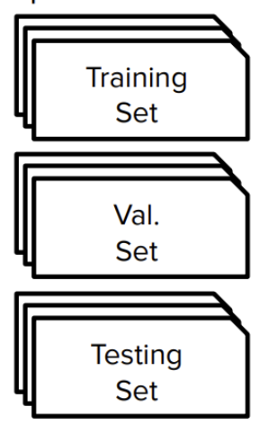
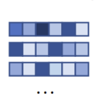
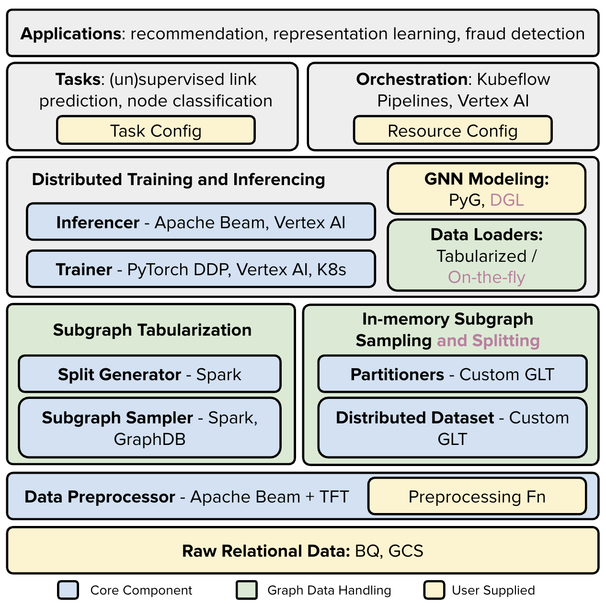

# GiGL Architecture

## Components

GiGL contains six components, each designed to facilitate the platforms end-to-end graph machine learning (ML) tasks.
The components and there documentation (linked) are as follows:


[**Config Populator**](components/config_populator.md): Processing template config files and updating with fields that
are needed for downstream components.


[**Data Preprocessor**](components/data_preprocessor.md): Reading and processing node, edge, and feature/data
engineering.


[**Subgraph Sampler**](components/subgraph_sampler.md): Generate k-hop localized subgraphs for each node in the graph.



[**Split Generator**](components/split_generator.md): Split the data into training, validation, and test sets.


[**Trainer**](components/trainer.md): Run distributed training either locally or on the cloud.



[**Inferencer**](components/inferencer.md): Runs inference to generate output embeddings and/or predictions.

#### For convenience we link the source code pointers:

| Component         | Source Code                                                               |
| ----------------- | ------------------------------------------------------------------------- |
| Config Populator  | {py:class}`gigl.src.config_populator.config_populator.ConfigPopulator`    |
| Data Preprocessor | {py:class}`gigl.src.data_preprocessor.data_preprocessor.DataPreprocessor` |
| Subgraph Sampler  | {py:class}`gigl.src.subgraph_sampler.subgraph_sampler.SubgraphSampler`    |
| Split Generator   | {py:class}`gigl.src.split_generator.split_generator.SplitGenerator`       |
| Trainer           | {py:class}`gigl.src.training.trainer.Trainer`                             |
| Inferencer        | {py:class}`gigl.src.inference.inferencer.Inferencer`                      |

## Diagrams

The figure below illustrates at a high level how all the components work together.
(<span style="color:purple">Purple</span> items are work-in-progress.)



The figure below is a example GiGL workflow with tabularized subgraph sampling for the task of link prediction, in which
the model is trained with triplet-style contrastive loss on a set of anchor nodes along with their positives and
(in-batch) negatives.


```{toctree}
:maxdepth: 2
:hidden:

components/config_populator
components/data_preprocessor
components/subgraph_sampler
components/split_generator
components/trainer
components/inferencer
```
