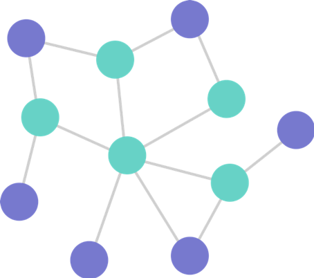
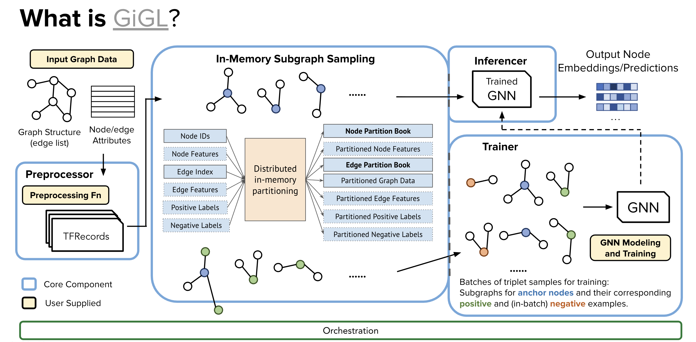

# GiGL Architecture

GiGL now has two execution models:

- The current, recommended path uses in-memory subgraph sampling, where the graph is loaded into memory and sampled live
  during training and inference. If you are looking for the older tabularized pipeline, see
  [Deprecated tabularized docs](deprecated_tabularized/index.md).
- The older tabularized path materializes sampled subgraphs ahead of time through Subgraph Sampler and Split Generator.
  NOTE: The tabularized version of GiGL will be removed in a future release.

This page focuses on the current in-memory subgraph sampling architecture and points to the legacy docs separately.

## Primary Pipeline Flow

The primary GiGL flow is:

```text
Config Populator -> Data Preprocessor -> Trainer? -> Inferencer -> Post Processor
```

`Trainer` is optional. Inference-only pipelines skip training and run inference against a graph using a pre-trained
model.

For the shared runtime behavior behind the current path, see
[In-Memory Subgraph Sampling](in_memory_subgraph_sampling.md).

## Components


[**Config Populator**](components/config_populator.md): Freezes the template task config into a runnable `GbmlConfig`.



[**Data Preprocessor**](components/data_preprocessor.md): Builds graph metadata, transforms features, and enumerates
node IDs into compact integer IDs.


[**Trainer**](components/trainer.md): Launches either legacy training or in-memory subgraph sampling training.


[**Inferencer**](components/inferencer.md): Launches either legacy inference or in-memory subgraph sampling inference.

[**Post Processor**](components/post_processor.md): Restores original node IDs for outputs produced by in-memory
subgraph sampling and runs optional user-defined post-processing logic.

### Component Diagram

Below is a high-level system overview. Note that both training and inference are backed by the same in-memory graph
sampling engine.



### Source Entry Points

| Component         | Source Code                                                               |
| ----------------- | ------------------------------------------------------------------------- |
| Config Populator  | {py:class}`gigl.src.config_populator.config_populator.ConfigPopulator`    |
| Data Preprocessor | {py:class}`gigl.src.data_preprocessor.data_preprocessor.DataPreprocessor` |
| Trainer           | {py:class}`gigl.src.training.trainer.Trainer`                             |
| Inferencer        | {py:class}`gigl.src.inference.inferencer.Inferencer`                      |
| Post Processor    | {py:class}`gigl.src.post_process.post_processor.PostProcessor`            |

## Related Guides

- For the shared in-memory runtime, deployment modes, example entry points, and cost discussion, see
  [In-Memory Subgraph Sampling](in_memory_subgraph_sampling.md).
- For stage-specific behavior and configuration, use the component guides linked above.

## Deprecated Tabularized Architecture

If you are maintaining an older deployment that still relies on precomputed sampled subgraphs, see
[Deprecated tabularized docs](deprecated_tabularized/index.md).

That flow is:

```text
Config Populator -> Data Preprocessor -> Subgraph Sampler -> Split Generator -> Trainer -> Inferencer
```

```{toctree}
:maxdepth: 2
:hidden:

components/config_populator
components/data_preprocessor
components/trainer
components/inferencer
components/post_processor
in_memory_subgraph_sampling
deprecated_tabularized/index
```
