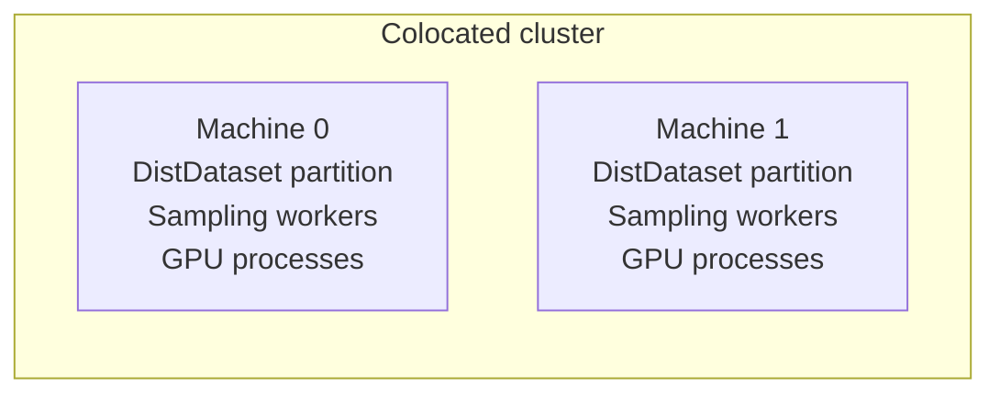
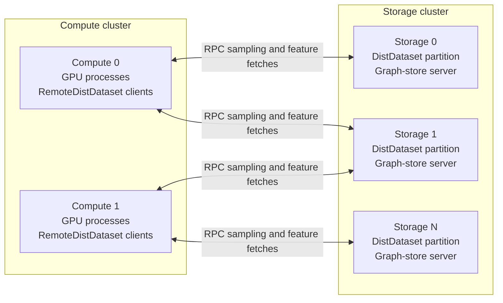
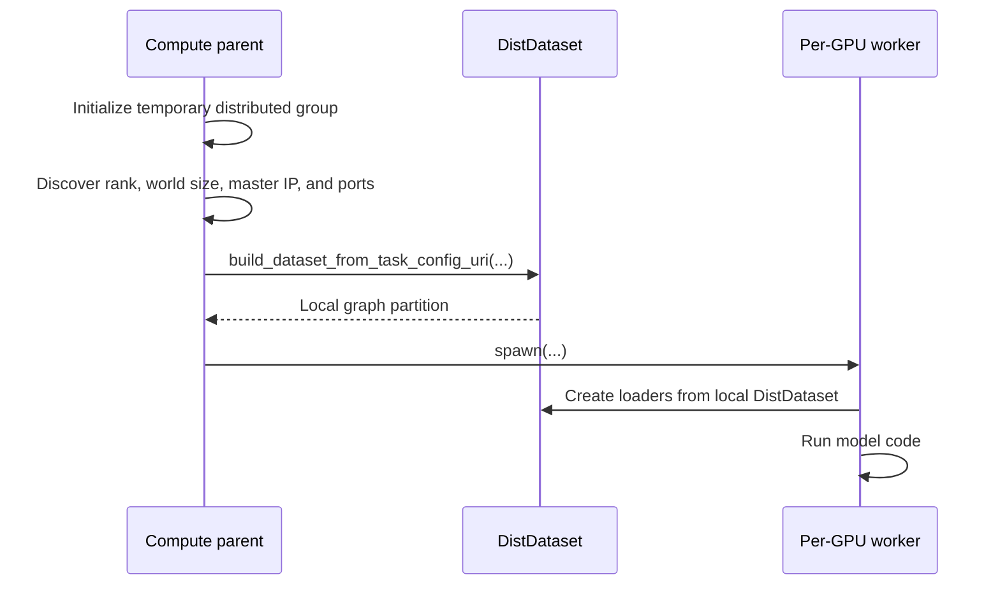
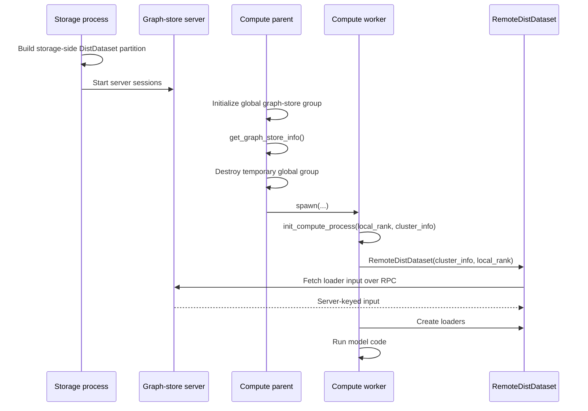
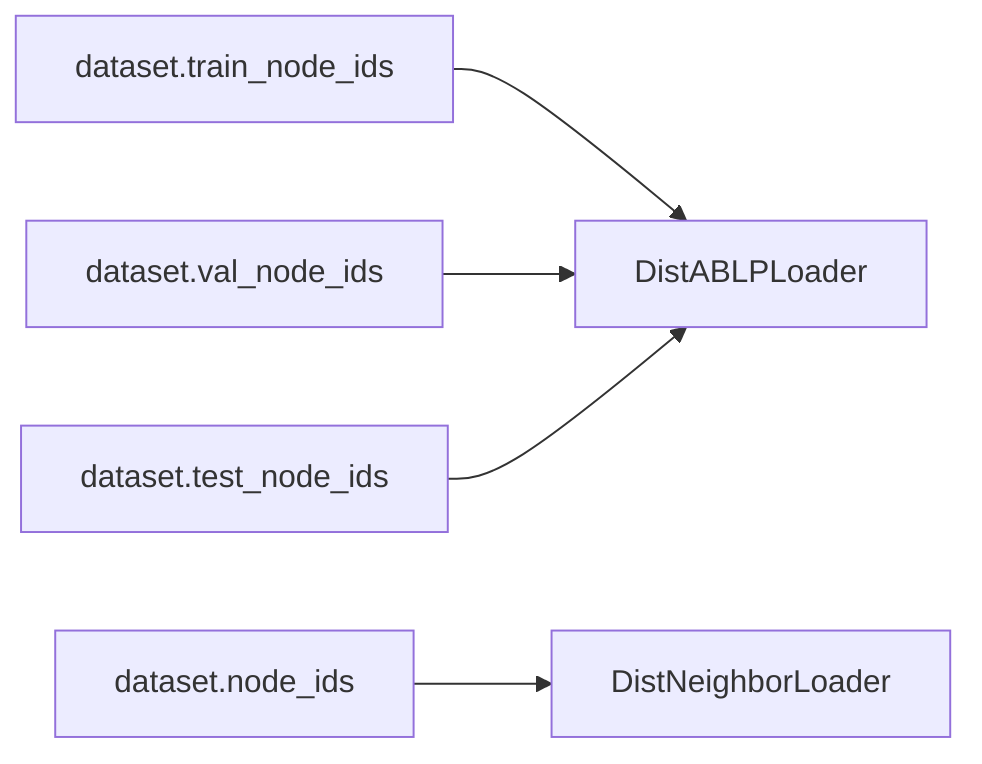
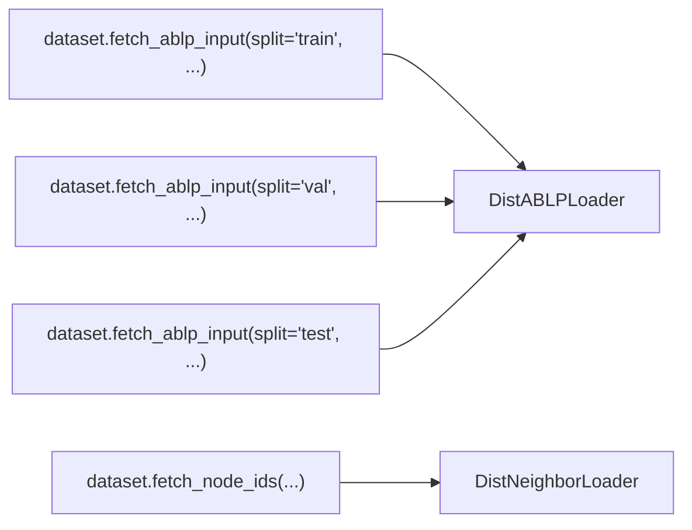
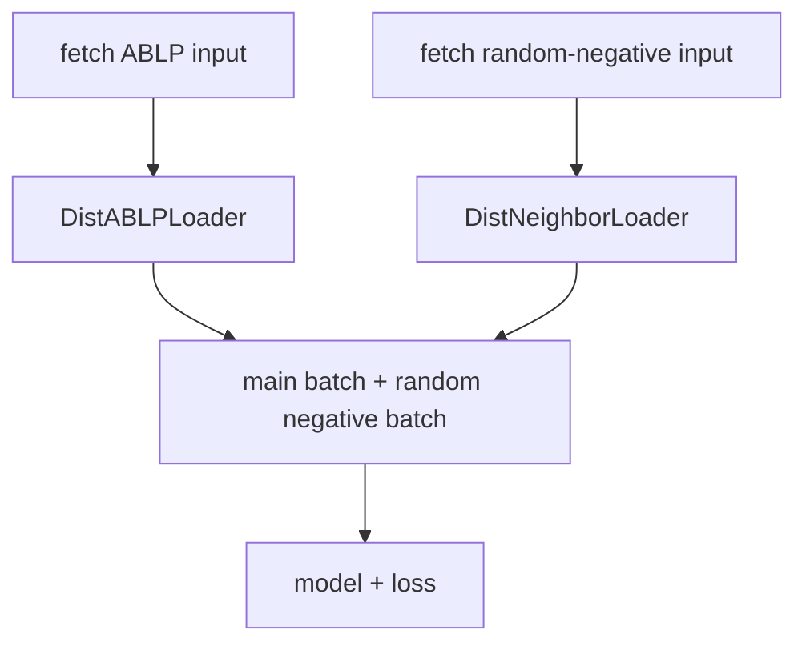
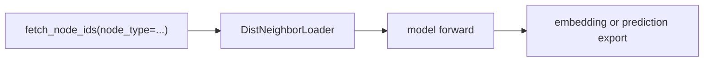
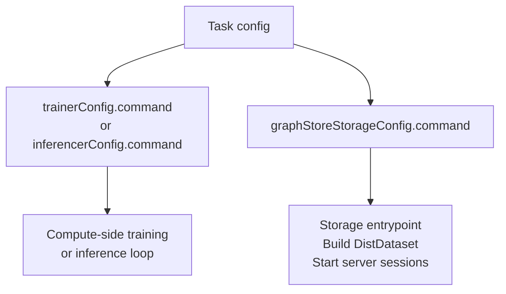
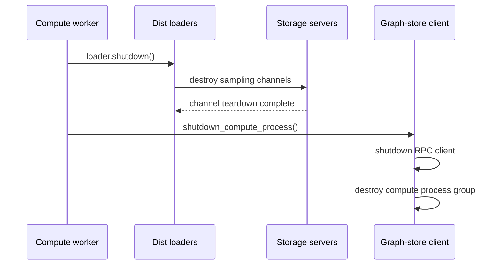

# Converting Colocated Loops To Graph Store

This guide is for training and inference loops that already use GiGL's in-memory sampling path with `DistDataset`,
`DistNeighborLoader`, or `DistABLPLoader`.

The goal is not to rewrite model code. The goal is to move graph ownership out of the compute machines and into a
storage cluster, then let compute processes sample from that graph over RPC.

The link prediction examples under `examples/link_prediction` are useful references, but treat them as examples of the
pattern rather than a checklist to diff line by line.

## Mental Model

Colocated mode puts graph storage and model compute on the same machines:



Graph store mode separates those roles:



`RemoteDistDataset` is the important name to read carefully. It is not a remote copy of the graph and it is not built
the same way as `DistDataset`. It is a client handle that lets a compute process talk to storage nodes.

## The Main Ordering Difference

In colocated mode, the compute machine builds a real `DistDataset` before spawning local GPU processes:



In graph store mode, the storage cluster builds the real `DistDataset`. Compute workers only create a
`RemoteDistDataset` after the graph-store cluster and the per-process client setup exist:



That timing is the core migration point. `DistDataset` is constructed once per graph-owning machine. `RemoteDistDataset`
is constructed inside each compute process, after `init_compute_process(...)` has connected that process to the storage
servers and initialized the compute process group.

## Compute-Side Shape

A graph-store compute parent usually only needs the cluster topology before spawning workers:

```python
torch.distributed.init_process_group(backend="gloo")
cluster_info = get_graph_store_info()
torch.distributed.destroy_process_group()

mp.spawn(
    fn=run_worker,
    args=(cluster_info, ...),
    nprocs=local_world_size,
)
```

The worker then joins the graph-store client setup and creates the remote dataset handle:

```python
def run_worker(local_rank: int, cluster_info: GraphStoreInfo, ...) -> None:
    init_compute_process(local_rank, cluster_info)
    dataset = RemoteDistDataset(cluster_info, local_rank)

    rank = torch.distributed.get_rank()
    world_size = torch.distributed.get_world_size()
```

Use `rank` and `world_size` from `torch.distributed` after `init_compute_process(...)`. At that point they describe the
compute process group, including all per-GPU processes across compute machines.

## Data Access Changes

In colocated mode, loader input is usually read directly from local dataset fields:



In graph-store mode, compute processes fetch the input from storage:



For anchor-based link prediction, fetch the main batch input from storage:

```python
ablp_input = dataset.fetch_ablp_input(
    split="train",
    rank=torch.distributed.get_rank(),
    world_size=torch.distributed.get_world_size(),
    anchor_node_type=anchor_node_type,              # heterogeneous only
    supervision_edge_type=supervision_edge_type,    # heterogeneous only
)

main_loader = DistABLPLoader(
    dataset=dataset,
    num_neighbors=num_neighbors,
    input_nodes=ablp_input,
    batch_size=main_batch_size,
    num_workers=sampling_workers_per_process,
)
```

For random negatives or inference seed nodes, fetch node IDs from storage:

```python
node_ids = dataset.fetch_node_ids(
    rank=torch.distributed.get_rank(),
    world_size=torch.distributed.get_world_size(),
    node_type=node_type,  # heterogeneous only
)

loader = DistNeighborLoader(
    dataset=dataset,
    num_neighbors=num_neighbors,
    input_nodes=(node_type, node_ids),  # use node_ids directly for homogeneous graphs
    batch_size=batch_size,
    num_workers=sampling_workers_per_process,
)
```

The loader input shape changes because storage nodes own the graph partitions:

| Loader               | Colocated input                  | Graph-store input                                      |
| -------------------- | -------------------------------- | ------------------------------------------------------ |
| `DistABLPLoader`     | `Tensor` or `(NodeType, Tensor)` | `dict[int, ABLPInputNodes]`                            |
| `DistNeighborLoader` | `Tensor` or `(NodeType, Tensor)` | `dict[int, Tensor]` or `(NodeType, dict[int, Tensor])` |

The `int` keys in graph-store inputs are storage ranks. Empty tensors for a storage rank are normal; they mean that this
compute rank has no input assigned to that storage server.

## Training Notes

Training needs storage-side splits. The storage process has to build its `DistDataset` with the splitter that creates
the train, validation, and test node IDs. If it does not, calls such as `fetch_ablp_input(split="train", ...)` have
nothing to fetch.

The rest of the training loop should look familiar:



Model construction, loss calculation, optimizer steps, validation, metric writing, and model saving usually do not need
graph-store-specific behavior. The main exceptions are places that assumed a colocated machine rank or assumed the
dataset object already existed before local worker processes were spawned.

For heterogeneous ABLP, be explicit about edge direction. If the storage splitter is configured with inbound sampling,
the supervision edge type passed to the splitter may need to be the reverse of the user-facing prediction edge type.
This is a graph direction issue, not a graph-store-specific model issue.

## Inference Notes

Inference usually does not need train, validation, or test splits. The compute worker fetches the target node IDs from
storage and passes them to `DistNeighborLoader`.



Model loading, batching, embedding export, and BigQuery loading can usually stay the same. Watch for any code that uses
the old colocated machine rank to decide which process writes shared outputs. In graph-store compute workers,
`torch.distributed.get_rank() == 0` is the usual lead-process check after `init_compute_process(...)`.

## Storage And Resource Config

Graph store jobs run two entrypoints: one for compute and one for storage.



For training, the storage args need enough information to create splits:

```yaml
trainerConfig:
  command: python -m my_package.training_graph_store
  graphStoreStorageConfig:
    command: python -m my_package.storage_main
    storageArgs:
      sample_edge_direction: "in"
      splitter_cls_path: "gigl.utils.data_splitters.DistNodeAnchorLinkSplitter"
      splitter_kwargs: >-
        {
          "sampling_direction": "in",
          "should_convert_labels_to_edges": True,
          "num_val": 0.1,
          "num_test": 0.1
        }
      num_server_sessions: "1"
```

For inference, the storage args are often simpler because inference can query all target nodes:

```yaml
inferencerConfig:
  command: python -m my_package.inference_graph_store
  graphStoreStorageConfig:
    command: python -m my_package.storage_main
    storageArgs:
      sample_edge_direction: "in"
      num_server_sessions: "1"
```

The resource config also changes from a single Vertex AI pool to separate graph-store and compute pools:

```yaml
trainer_resource_config:
  vertex_ai_graph_store_trainer_config:
    graph_store_pool:
      machine_type: n2-highmem-32
      gpu_type: ACCELERATOR_TYPE_UNSPECIFIED
      gpu_limit: 0
      num_replicas: 2
    compute_pool:
      machine_type: n1-standard-16
      gpu_type: NVIDIA_TESLA_T4
      gpu_limit: 2
      num_replicas: 2
```

Use the graph-store pool for memory-heavy graph serving. Use the compute pool for model work, usually with GPUs. If you
need to override how many compute processes run per compute machine, use `compute_cluster_local_world_size` in the
graph-store resource config.

`num_server_sessions` should match how many separate compute process groups will connect to storage over the lifetime of
the job. Training commonly uses one session. Heterogeneous inference may use one session per node type if the inference
loop runs node types sequentially with separate spawned process groups.

## Shutdown Order

Shut down loaders before shutting down the compute process:



Loader shutdown tears down server-side sampling channels. `shutdown_compute_process()` tears down the graph-store client
and the compute process group. Calling them in the opposite order leaves storage with live sampling state and can make
shutdown slow or noisy.

## Where To Look Next

The link prediction examples show the pattern in real code:

- Colocated training and inference:
  [`examples/link_prediction`](https://github.com/Snapchat/GiGL/tree/main/examples/link_prediction)
- Graph-store training and inference:
  [`examples/link_prediction/graph_store`](https://github.com/Snapchat/GiGL/tree/main/examples/link_prediction/graph_store)
- Graph-store task and resource configs:
  [`examples/link_prediction/graph_store/configs`](https://github.com/Snapchat/GiGL/tree/main/examples/link_prediction/graph_store/configs)

The storage entrypoint in `examples/link_prediction/graph_store/storage_main.py` is also useful if you need to write a
custom storage command.
