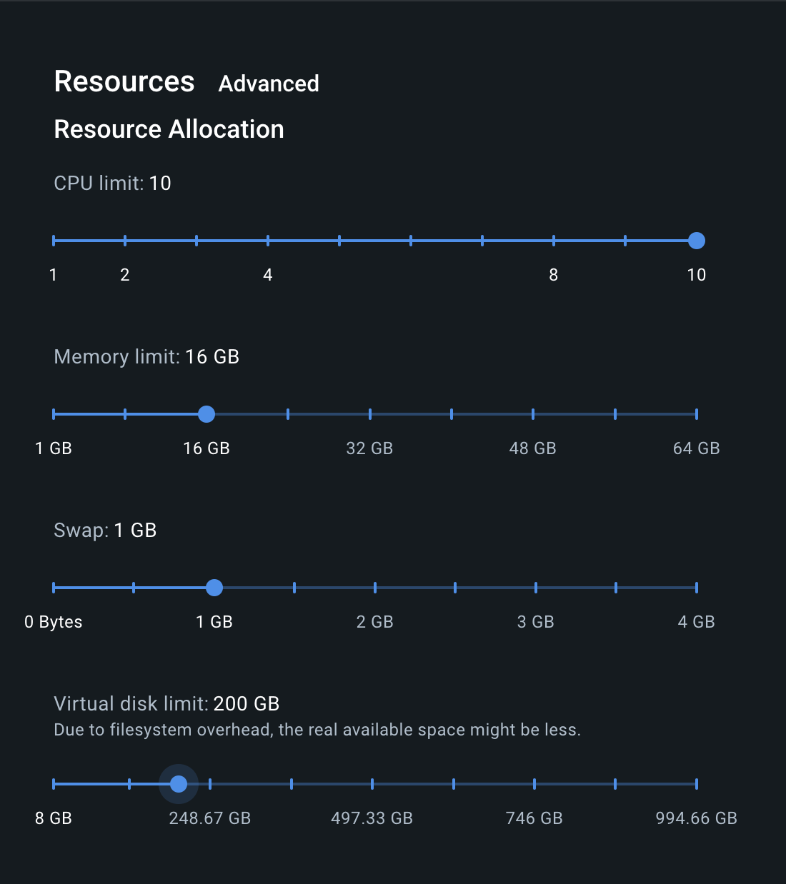

# FAQ.md

## Table Of Contents

## Table Of Contents

- [Questions](#questions)
  - [What is Pre-commit?](#what-is-pre-commit)
    - [Skip pre-commit hooks](#skip-pre-commit-hooks)
  - [How do I add a new package?](#how-do-i-add-a-new-package)
- [Issues](#issues)
  - [Error: no space left on device](#error-no-space-left-on-device)
  - [Error: scalafix.sbt.ScalafixFailed: NoFilesError](#error-scalafixsbtscalafixfailed-nofileserror)
  - [Docker debugging](#docker-debugging)
  - [Scala build issues](#scala-build-issues)

## Questions

### What is Pre-commit

See https://pre-commit.com. We use `pre-commit` hooks to facilitate development. These are scripts that run before each
commit to perform checks and validations, helping maintain code quality and consistency. Hooks are
configured in the `.pre-commit-config.yaml` file. Whenever you attempt to commit changes, these pre-commit hooks will
automatically run. If any of the hooks fail, the commit will be aborted, allowing you to fix the issues before
proceeding.

#### Skip pre-commit hooks

**Note**: You can run `git commit --no-verify -m "Commit message"` to temporarily skip pre-commit hooks and unblock
issues.

### How do I add a new package?

Follow the [Adding a new Package as a Dependency](./adding_new_package.md) guide

## Issues

### Error: no space left on device

(When building docker images.)

1. Allocate more resources to docker i.e. 

2. Run `make stop_toaster` to clean up old images

### Error: scalafix.sbt.ScalafixFailed: NoFilesError

This error can appear when trying to run `make format`.

```
[info] Running scalafix on 55 Scala sources (incremental)
[error] No files to fix
[info] compiling 9 Scala sources to /scala/split_generator/target/scala-2.12/test-classes ...
[warn] one deprecation (since 2.0.0); re-run with -deprecation for details
[warn] one warning found
[error] (common / scalafixAll) scalafix.sbt.ScalafixFailed: NoFilesError
```

If this happens, `cd` into the `scala` and `scala_spark35` folders and run `sbt clean` in each.

### Docker debugging

(1) These instances will have Docker installed. You can debug issues with a given image tag on the dev instance (*with
GPUs*) via: `docker run -it --gpus all <YOUR_DOCKER_IMAGE_TAG> /bin/bash`

which will launch an interactive container with the given tagged image and expose the GPUs inside the Docker container.

(2) If during building Docker images, you observe an error related to multiarchitecture emulation e.g.:

```bash
.buildkit_qemu_emulator: /bin/bash: Invalid ELF image for this architecture
```

the below command is a fix:

```bash
docker run --rm --privileged multiarch/qemu-user-static --reset -p yes
```

(3) If you observe the below error on kfp

```
ImagePullBackOff: Back-off pulling image "<IMAGE_NAME>"
```

or

```
failed to pull and unpack image "<IMAGE_NAME>": no match for platform in manifest: not found
```

Try running `docker run <IMAGE_NAME>`; maybe the image was not built, or it cant be found due to permission issues.

### Scala build issues

Occassionally, you may see issues like the below when building Scala files.

```
[error] import io.grpc.netty.GrpcSslContexts
[error]        ^
[error] import io.grpc.netty.NettyChannelBuilder
[error]        ^
[error] import io.netty.handler.ssl.SslContextBuilder
[error]           ^
[error]       val sslContextBuilder: SslContextBuilder = GrpcSslContexts.forClient();
[error]                              ^
```

To resolve this you may try the below:

- Running `make clean_build_files`

If that doesn't work then you can try clearing out your users Scala cache:

- Cleaning scala local cache `rm -rf ~/.ivy2`

If that doesn't work you can take a deep breath, make sure the first two steps *really* didn't work, get a snack, try
the first two steps again. If things still don't work, you can try rebuilding your dev environemnt, this is quite slow.

- Reinstall your dev environment `make install_dev_deps`
